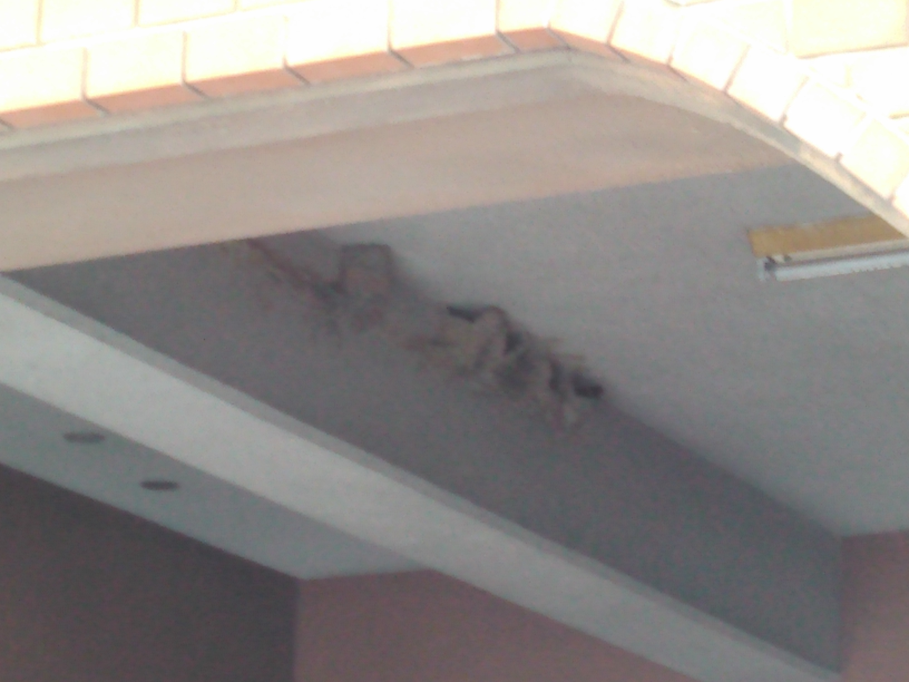

<!DOCTYPE html>
 <html lang=ja">
  <head>
    <meta charset="utf-8">
    <title>燕の巣</title>
     <link rel="stylesheet" href="css/default.css" type="text/css">
  </head>
  <body>
  
燕の巣

  
  </body>
 </html>
